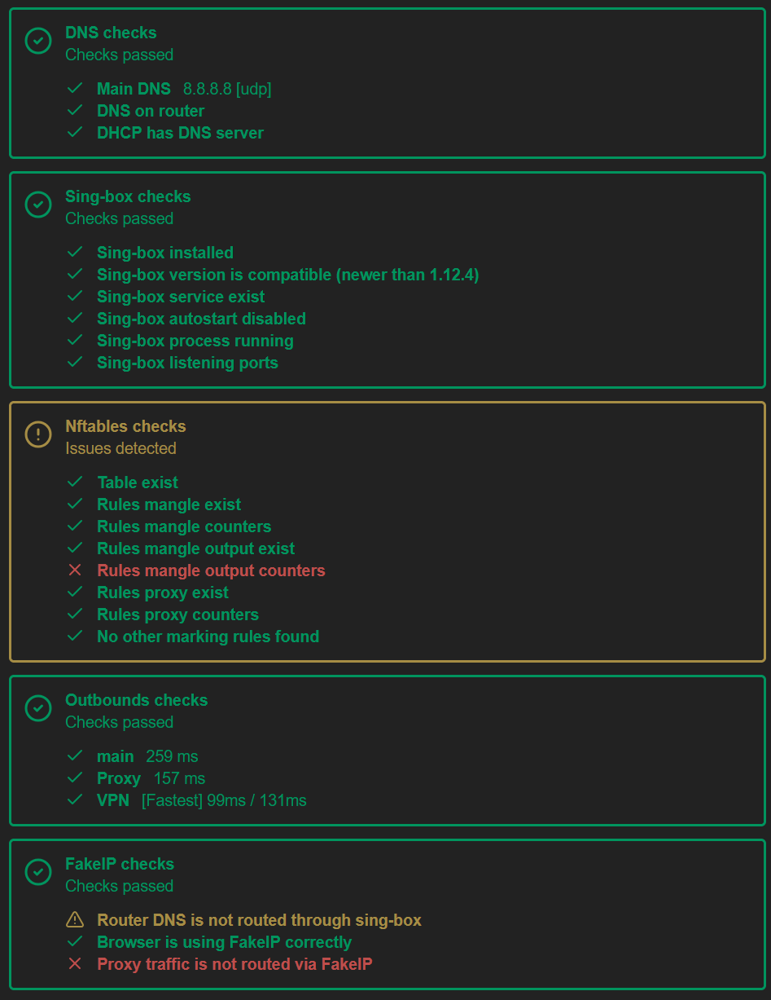
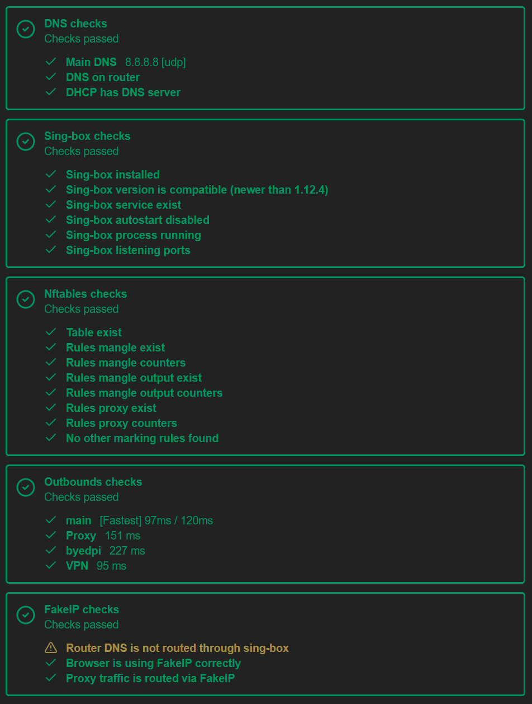

# Гайд по установке и настройке **Podkop** вместе с **ByeDPI** на OpenWrt с пакетным менеджером **opkg**.

## [Ссылка](https://github.com/DPITrickster/Podkop-ByeDPI-OpenWRT/blob/main/readme.apk.md) на гайд для OpenWrt с пакетным менеджером **apk**.

> [!IMPORTANT]
> Если ваш провайдер перехватывает DNS-запросы - требуются меры по их защите, иначе ByeDPI не будет работать.
> Podkop несовместим с пакетом `https-dns-proxy` и схема FakeIP может затруднить поиск подходящего решения для противодействия перехвату DNS.

## 0. Установка Podkop

Вся нужная информация о Podkop находится в [readme](https://github.com/itdoginfo/podkop?tab=readme-ov-file) репозитория и на [сайте](https://podkop.net/) с документацией.

## 1. Установка ByeDPI

### Узнайте архитектуру устройства

```sh
opkg print-architecture
awk -F\' '/DISTRIB_ARCH/ {print $2}' /etc/openwrt_release
```

### Скачайте нужный пакет

Замените ссылку на скачивание с учётом архитектуры из последнего [релиза](https://github.com/DPITrickster/ByeDPI-OpenWrt/releases):

> [!WARNING]
> **Generic Packages** - пакеты, собранные из upstream бинарников и могут не полностью соответствовать ABI OpenWrt. Используйте их только, если не нашли пакет, собранный нативно

```sh
(cd /tmp && curl -LO https://github.com/DPITrickster/ByeDPI-OpenWrt/releases/download/v0.17.2-24.10/byedpi_0.17.2-r1_aarch64_cortex-a53.ipk)
```

### Установите пакет

> [!NOTE]
> При необходимости удалите старую версию.

Название пакета замените на актуальное

```sh
opkg remove byedpi
opkg install /tmp/byedpi_0.17.2-r1_aarch64_cortex-a53.ipk
```

### Оредактируйте конфиг ByeDPI

#### Откройте файл:

> [!NOTE]
> В примере используется текстовый редактор `vi`, так как он является предустановленным. Документацию можно найти [здесь](https://man.archlinux.org/man/vi.1). Можете установить `nano` или любой другой редактор.

```sh
vi /etc/config/byedpi
```

#### Добавьте рабочую стратегию (пример):

```sh
config byedpi
    option enabled '1'
    option options '-o 2 --auto=t,r,a,s -d 2'
```

> [!WARNING]
> Подберите стратегию при помощи [ByeByeDPI](https://github.com/romanvht/ByeByeDPI) или [ByeDPI Manager](https://github.com/romanvht/ByeDPIManager) (желательно заранее).

### Запустите сервис

```sh
/etc/init.d/byedpi enable
/etc/init.d/byedpi start
```

### Для OpenWrt 24.10 отключите использование `dnsmasq` в качестве локального резолвера

```sh
uci set dhcp.@dnsmasq[0].localuse='0'
uci commit dhcp
```

---

## 2. Настройка Podkop

### Добавьте секцию для ByeDPI

- Тип подключения: `Proxy`
- Тип конфигурации: `Connection URL` (рекомендуется) или `URLTest`  
- Ссылка прокси для Connection URL или URLTest: `socks5://127.0.0.1:1080#byedpi` (если не меняли порт `1080` на другой)

> [!WARNING]
> URLTest может показывать значения для byedpi гораздо бóльшие, чем для прокси или VPN, поэтому весь трафик может пойти не в byedpi, а через удалённый сервер. Рекомендуется выделять для byedpi отдельную секцию с *Connection URL*.

> [!NOTE]
> Не забудьте добавить нужные [списки](https://podkop.net/docs/sections/), с которыми будет взаимодействовать ByeDPI.

---

## 3. Финальные шаги

### Перезагрузите роутер

> [!CAUTION]
> Перезагрузить роутер обязательно - без этого dnsmasq останется локальным резолвером!

```sh
reboot
```

### Проверьте работу ByeDPI

```sh
ps | grep ciadpi
netstat -tulnp | grep 1080
```

Если процессы активны — всё работает.

## Примечание

Если указать в `main` секции byedpi, то диагностика будет выглядеть так:



Если **не указывать** byedpi в секции `main` - диагностика будет выгдеть так:



В обоих случаях причин для беспокойства нет: диагностика расчитана на стандартные ситауации и на проверку работы подключений к удалённым серверам. Если всё работает, то обращать внимание на диагностику не следует.

## Большое спасибо

- **[itdoginfo](https://github.com/itdoginfo)** за [podkop](https://github.com/itdoginfo/podkop)
- **[hufrea](https://github.com/hufrea)** за [byedpi](https://github.com/hufrea/byedpi)
- **[spvkgn](https://github.com/spvkgn)** за пакет ByeDPI и возможность его сборки
- **[romanvht](https://github.com/romanvht)** за возможность тестировать стратегии
- **[StressOzz](https://github.com/StressOzz)** за [инструкцию](https://github.com/StressOzz/Podkop-Manager/blob/main/readme.hand.md)
